```mermaid
graph LR
    A[🎓 Learning] -->|Practice| B[💻 Building]
    B -->|Testing| C[🚀 Deploying]
    C -->|Monitoring| D[📈 Scaling]
    D -->|Improving| E[🌟 Innovating]
    E -->|Repeat| A
    
    style A fill:#FF6B35,stroke:#FF4500,stroke-width:2px,color:#fff
    style B fill:#FF4500,stroke:#FF6347,stroke-width:2px,color:#fff
    style C fill:#FF8C00,stroke:#FF6B35,stroke-width:2px,color:#fff
    style D fill:#FFA500,stroke:#FF8C00,stroke-width:2px,color:#fff
    style E fill:#FFD700,stroke:#FFA500,stroke-width:2px,color:#000
```

<div align="center">


---

<p align="center">
  
  
  
</p>


<p align="center">
<a href="https://www.linkedin.com/in/abhinav-vats25">

</a>
<a href="mailto:abhinav.is.av@gmail.com">

</a>
<a href="https://leetcode.com/u/Av_is_av/">

</a>
<a href="https://github.com/Avisav24">

</a>
</p>


</div>

---


##  About Me


```javascript
const abhinav = {
    pronouns: "He" | "Him",
    location: "India 🇮🇳",
    currentRole: "CSE Student @ 3rd Year",
    
    codingLanguages: [
        "Python", "JavaScript", 
        "HTML/CSS", "SQL"
    ],
    
    spokenLanguages: [
        "English", "Hindi",
        "Telugu (Learning)", 
        "Marathi (Learning)"
    ],
    
    currentFocus: [
        "🤖 AI/ML Engineering",
        "💻 Full-Stack Development",
        "📊 Data Science & Analytics",
        "🧠 Competitive Programming"
    ],
    
    learning: [
        "Advanced Machine Learning",
        "Cloud Computing (AWS/Azure)",
        "System Design",
        "DSA Mastery"
    ],
    
    askMeAbout: [
        "Web Dev", "AI", "Python", 
        "APIs", "Data Analytics", "LeetCode"
    ],
    
    funFact: "I turn caffeine into code ☕️→💻",
    goals2025: "Contribute to Open Source & Master AI"
};
```

<br clear="right"/>

<div align="center">

> 💡 **Mission:** Creating intelligent solutions that bridge AI and real-world problems  
> 🎯 **Vision:** Building scalable systems that make a difference

</div>


---

##  Tech Arsenal

<div align="center">

### 💻 Programming Languages

<p>


</p>

### 🌐 Frameworks & Libraries

<p>


</p>

### 🤖 AI & Data Science

<p>


</p>

### 🔧 Tools & Platforms

<p>


</p>

### 🏆 Competitive Programming

<p>


</p>

### 🗣️ Spoken Languages

<p>


</p>

</div>


---

##  Featured Projects

<div align="center">

<table>
<tr>
<td width="50%" valign="top">

<h3 align="center">🗳️ Indian Election Result Predictor</h3>

<div align="center">
<a href="https://github.com/Avisav24/IndianElection_ResultPredictor">

</a>
</div>

<p align="center">AI-powered sentiment analysis & prediction model using Twitter data</p>

<p align="center">
<a href="https://github.com/Avisav24/IndianElection_ResultPredictor">

</a>

</p>

**Tech Stack:**
<p align="center">


</p>

</td>
<td width="50%" valign="top">

<h3 align="center">📊 NSE Data Downloader</h3>

<div align="center">
<a href="https://github.com/Avisav24/NSE_Data_Downloader">

</a>
</div>

<p align="center">Python-based tool for fetching and analyzing stock market data</p>

<p align="center">
<a href="https://github.com/Avisav24/NSE_Data_Downloader">

</a>

</p>

**Tech Stack:**
<p align="center">


</p>

</td>
</tr>
</table>

</div>


---

##  GitHub Analytics

<div align="center">

<a href="https://github.com/Avisav24">


</a>

<br><br>


<br><br>


</div>


---

##  GitHub Trophies

<div align="center">

[](https://github.com/ryo-ma/github-profile-trophy)

</div>


---

##  Contribution Snake

<div align="center">

<picture>
  <source media="(prefers-color-scheme: dark)" srcset="https://raw.githubusercontent.com/Avisav24/Avisav24/output/github-snake-dark.svg">
  <source media="(prefers-color-scheme: light)" srcset="https://raw.githubusercontent.com/Avisav24/Avisav24/output/github-snake.svg">
  
</picture>

</div>


---

##  Connect with Me

<div align="center">

### 📬 Let's Build Something Amazing Together! 🔥

<p>
<a href="https://www.linkedin.com/in/abhinav-vats25">

</a>
<a href="mailto:abhinav.is.av@gmail.com">

</a>
<a href="https://leetcode.com/u/Av_is_av/">

</a>
<a href="https://github.com/Avisav24">

</a>
</p>


</div>


---

##  Beyond Code

<div align="center">

<table>
<tr>
<td align="center" width="25%">
<br>
<b>💪 Fitness</b><br>
<sub>Building strength & discipline</sub>
</td>
<td align="center" width="25%">
<br>
<b>🎬 Video Editing</b><br>
<sub>Creating visual stories</sub>
</td>
<td align="center" width="25%">
<br>
<b>🌌 Cosmology</b><br>
<sub>Exploring the universe</sub>
</td>
<td align="center" width="25%">
<br>
<b>🗣️ Languages</b><br>
<sub>Learning Telugu & Marathi</sub>
</td>
</tr>
</table>

</div>


---

##  Achievements & Highlights

<div align="center">


</div>


---

##  Random Dev Quote

<div align="center">


</div>


---

##  Coding Stats & Activity

<div align="center">

### 🎯 Current Focus

```text
🤖 AI/ML Engineering     ████████████████░░░░░   80%
💻 Full-Stack Dev        ███████████████░░░░░░   75%
🧠 Data Structures       ██████████████░░░░░░░   70%
🏗️ System Design         ████████░░░░░░░░░░░░░   40%
```

### 📊 Weekly Development Breakdown

```text
Python       12 hrs 30 mins  ███████████░░░░░░   45%
JavaScript   8 hrs 15 mins   ██████░░░░░░░░░░░   30%
HTML/CSS     4 hrs 20 mins   ███░░░░░░░░░░░░░░   15%
Other        2 hrs 45 mins   ██░░░░░░░░░░░░░░░   10%
```

</div>


---

##  My Coding Journey

<div align="center">



</div>


---

<div align="center">


### 💫 *"Code is poetry written in logic"* 💫

<br>

### 📧 **Reach out:** abhinav.is.av@gmail.com

<br>


**Last Updated:** 2025-01-07 08:12:41

<br>

### ⚡ Fun Fact
**I believe in learning by building and building by learning!** 🚀🔥

<br>


</div>
